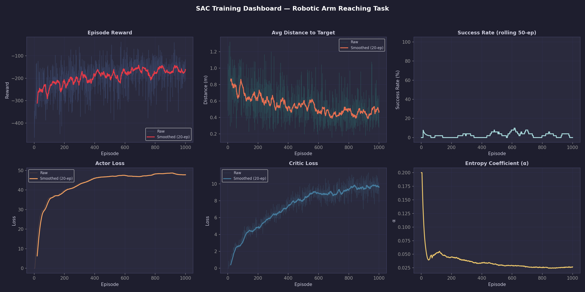

# 🤖 SAC Robotic Arm — Target Reaching

A continuously learning robotic arm trained using **Soft Actor-Critic (SAC)** in PyTorch and MuJoCo. The agent learns to robustly navigate a 3-joint simulated robotic arm to randomly spawned targets in 3D space.




## 🎯 About the Project

This project demonstrates a complete Deep Reinforcement Learning pipeline for continuous control robotics. I implemented SAC from scratch to build a stable, sample-efficient agent that can handle complex multi-joint movement. 

**Key Features:**
* **Soft Actor-Critic (SAC)**: Features twin critic networks, a Gaussian stochastic policy, and automatic entropy tuning.
* **Physics Simulation**: Custom-built MuJoCo environment (`robot_arm.xml`) with realistic joint limits and torques.
* **Reward Shaping**: Engineered a dense reward function balancing distance reduction, velocity penalization for smoothness, and a sparse success bonus.
* **Full Pipeline**: Includes a replay buffer, training loops, and a dashboard for tracking losses and success rates over time.

## 🚀 Quick Start

**1. Install Dependencies**
```bash
python -m venv .venv
.venv\Scripts\activate  # Windows
# source .venv/bin/activate  # macOS / Linux
pip install -r requirements.txt
```

**2. Watch the Trained Agent**
See the agent successfully reach randomly placed targets:
```bash
python demo_trained.py --targets 5
```

**3. Train it Yourself**
Launch the training loop (with live GUI):
```bash
python train.py
```
Monitor the training metrics in real-time via TensorBoard:
```bash
tensorboard --logdir=logs/tensorboard
```

## 🧠 What I Learned
Through building this, I gained hands-on experience translating complex academic papers into working code, debugging vanishing gradients in deep networks, tuning physical simulations, and designing effective reward functions for reinforcement learning.
